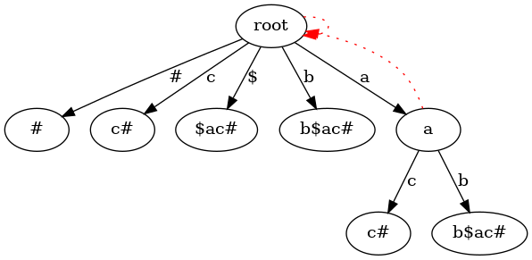
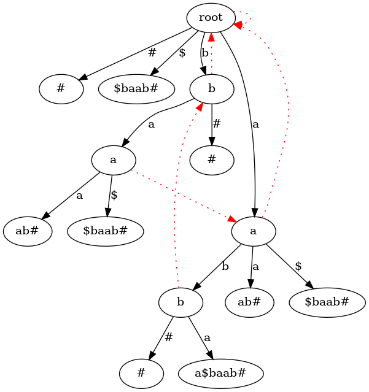

# Suffix Tree

Проект реализует структуру данных **Suffix Tree** с дополнительными возможностями визуализации и анализа.

### Суффиксное дерево
- Построение суффиксного дерева для строки за линейное время (алгоритм Укконена)

### Визуализация
- Вывод дерева в текстовом формате
- Подсветка суффиксов для разных входных строк
- Генерация графического представления (см. примеры в `assets/`)
- Инструменты для анализа структуры дерева

  
*Пример визуализации суффиксного дерева*

  
*Еще один пример работы алгоритма*

## Инструменты
- *C++ 20*
- *Google tests*
- *CMake/CTest 3.16* 
- *Clang-format-19*
- *Clang-tidy-19*
- *Graphviz*

## Компиляция
```shell
./runbuild.sh
```

## Расположение exe файла
```
./build/bin/suffix_tree
```

## Запуск тестов
```shell
./runtests.sh  
```

```shell
└─[$]> ./runtests.sh      
Test project /home/garik/PROJECTS/SuffixTree/build
    Start 1: SuffixTreeBasic
1/4 Test #1: SuffixTreeBasic ..................   Passed    0.00 sec
    Start 2: SuffixTreeStress
2/4 Test #2: SuffixTreeStress .................   Passed    0.68 sec
    Start 3: FormatCheck
3/4 Test #3: FormatCheck ......................   Passed    0.06 sec
    Start 4: TidyCheck
4/4 Test #4: TidyCheck ........................   Passed    6.56 sec

100% tests passed, 0 tests failed out of 4

Total Test time (real) =   7.31 sec
```

## Простой пример использования
В app написана простая программа постоения дерева из двух строк:
```
└─[$]> ./build/bin/suffix_tree 
abc
cbd
9
0 0 0 3
0 0 1 2
2 0 2 3
2 1 2 3
0 0 2 3
5 1 1 3
5 1 0 3
0 1 2 3
```

## Структура проекта
```shell
├── app/                        # Основное приложение
├── assets/                     # Ресурсы и изображения
├── include/                    # Заголовочные файлы
│ ├── SuffixTree.hpp            # Основной класс суффиксного дерева
│ ├── SuffixTreePrinter.hpp     # Текстовая визуализация дерева
│ ├── SuffixTreeVeriefer.hpp    # Валидация структуры
│ └── SuffixTreeVizualizer.hpp  # Графическая визуализация дерева
├── tests/                      # Тесты
│ ├── GoogleTests/              # Unit-тесты на Google Test
│ └── StaticAnalysis/           # Статический анализ кода
├── runbuild.sh                 # Скрипт сборки
└── runtests.sh                 # Скрипт запуска тестов
```